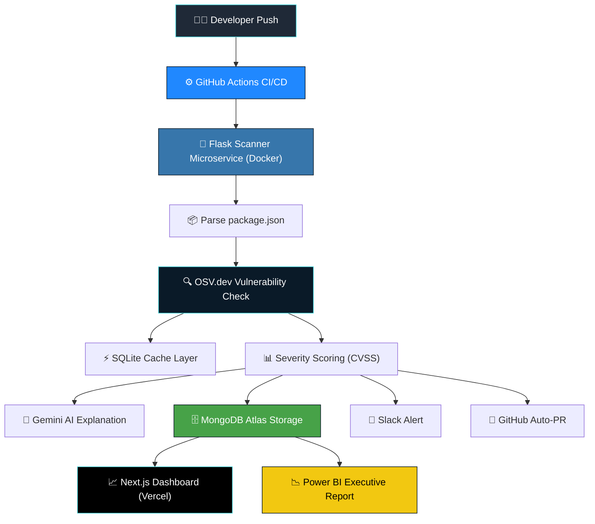

# 🔐 Nexlock

**Detect. Alert. Remediate.**

An AI-powered, CI/CD-integrated dependency vulnerability scanner that automatically detects known security vulnerabilities in a codebase, alerts teams in real time, and opens automated GitHub Pull Requests — closing the gap between vulnerability discovery and remediation.


🔗 **Live Dashboard:** [nex-lock-rho.vercel.app](https://nex-lock-rho.vercel.app)

---

## 📌 Problem

Dependencies are added to codebases constantly, and vulnerable versions slip in unnoticed until a breach happens. Most teams either don't scan for known CVEs at all, or only do it manually and infrequently — leaving a wide window between when a vulnerability is disclosed and when it's actually patched.

## 💡 Solution

Nexlock automates the entire vulnerability lifecycle. It hooks into a repository's CI/CD pipeline, scans every dependency against a live vulnerability database (OSV.dev), scores each finding by severity, alerts the team on Slack, opens a GitHub PR flagging the issue, and stores full scan history in a database that powers both a live web dashboard and executive-level Power BI reports.

---

## ✨ Key Features

- 🔍 **Live Vulnerability Intelligence** — real-time CVE lookups via the OSV.dev API for every dependency
- 📊 **Severity Scoring** — CVSS-based classification into Critical / High / Medium / Low
- ⚡ **SQLite Caching** — avoids redundant API lookups for previously scanned package versions
- 💬 **Slack Alerts** — instant, formatted notifications the moment a vulnerability is found
- 🔧 **Automated GitHub PRs** — auto-opens a Pull Request flagging the vulnerable dependency
- 🤖 **AI-Generated Explanations** — Gemini API integration for plain-English vulnerability summaries
- 🗄️ **Persistent Scan History** — every result stored in MongoDB Atlas
- 📈 **Live Dashboard** — Next.js dashboard with real-time severity breakdowns and scan feed
- 🔄 **CI/CD Automation** — GitHub Actions triggers a full scan on every push
- 🐳 **Dockerized Microservice** — the scanner runs as a portable, containerized service
- 📉 **Power BI Reporting** — executive-facing severity and trend visualizations

---

## 🏗️ Architecture

The system follows a two-service architecture connected by a shared data layer:

| Layer | Responsibility |
|---|---|
| 🎨 Presentation Layer | Live dashboard (Next.js, deployed on Vercel) |
| 🔄 Automation Layer | GitHub Actions CI/CD, GitHub PR automation |
| ⚙️ Service Layer | Dependency parsing, OSV.dev scanning, severity scoring, Gemini AI explanations |
| 🗄️ Data Layer | MongoDB Atlas (persistent history), SQLite (local cache) |
| 📊 Reporting Layer | Power BI (executive dashboards) |

### Architecture Diagram



### Process Flow
Code Push → GitHub Actions → Flask Scanner
→ Parse package.json → Check OSV.dev → Cache in SQLite
→ Score Severity → Save to MongoDB
→ Slack Alert + GitHub Auto-PR
→ Next.js Dashboard (live view) → Power BI (executive report)

---

## 🛠️ Tech Stack

| Category | Tools |
|---|---|
| Frontend | Next.js, React, Tailwind CSS |
| Hosting | Vercel |
| Backend | Python, Flask |
| Vulnerability Data | OSV.dev API |
| Caching | SQLite |
| Database | MongoDB Atlas |
| Alerts | Slack Incoming Webhooks |
| AI | Google Gemini API |
| Git Automation | GitHub REST API (PyGithub) |
| Containerization | Docker |
| CI/CD | GitHub Actions |
| Reporting | Power BI |

---

## 🚀 Getting Started

### Prerequisites
Python 3.11+, Node.js 20+, Docker, MongoDB Atlas account

### Installation

**Scanner:**
```bash
git clone https://github.com/AjayZordan/NexLock.git
cd NexLock/scanner
python3 -m venv venv
source venv/bin/activate
pip install -r requirements.txt
python3 app.py
```

**Dashboard:**
```bash
cd ../web
npm install
npm run dev
```

---

## 📁 Project Structure
nexlock/
├── web/                → Next.js dashboard (deployed on Vercel)
├── scanner/             → Python/Flask scanning microservice (Dockerized)
├── .github/workflows/    → GitHub Actions CI/CD pipeline
└── README.md
---

## 📄 License

This project is licensed under the [MIT License](LICENSE) — free to use, modify, and distribute with attribution.

---

## 👤 Author

**R. Ajay Kumar**
[GitHub](https://github.com/AjayZordan) · [LinkedIn](https://linkedin.com/in/ajaykumar-secdev)
